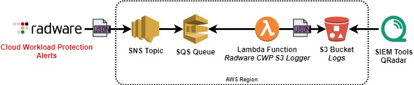

# Radware CWP S3 Logger
#### _A Log Source for SIEM Tools, etc._

This AWS tool was designed to consume logs pushed from Radware CWP and then write compressed files to AWS S3 for use cases such as downstream consumption by SIEM tools (e.g. IBM QRadar). Once logs are archived to S3, all S3-compatible tools can then consume them. 



The CFT deployment process will create an SNS Topic, SQS Queue, an IAM Role, and a Lambda Function. On the defined schedule, SQS messages are polled and then written to an S3 bucket. Additional triggers and schedules can be configured post-deployment as desired. 

## Setup
### Prerequisites

The following cloud assets are required ahead of the deployment:
- **S3 Bucket**: The destination for the logs.

### CFT Parameters
This CFT stack has 5 parameters, 4 of which are configured during deployment:

- **S3BucketForLogging** - Target S3 Bucket for Logs (e.g. `MyS3BucketName`).
- **LogFolderPrefix** - Log Folder Prefix. Context: `s3://S3BucketName/<Log-Folder-Prefix>/...`
- **LogObjectPrefix** - Log Object Prefix. Context: `<Log-File-Prefix>_YYYYMMDDTHHMMZ_<Alphanumeric-String>.log`
- **GzipEnabled** - Enable/disable gzip compression of log files. (e.g. `true` or `false`)

### [Option 1] One-click CFT Deployment:
[](https://console.aws.amazon.com/cloudformation/home?#/stacks/new?stackName=RadwareCWP-S3-Logger&templateURL=https://radware-cwp-devops-us-east-1.s3.amazonaws.com/radware_cwp_s3_logger/radware_cwp_s3_logger_cftemplate.yaml)
> Note: The AWS region you are actively logged into will be the region of deployment.
1. Fill in the parameter fields. 
1. Click **Next** twice.
1. Under **Capabilities and transforms**, click to check the **3** pending acknowledgements: "_I acknowledge..._".
1. Click **Create stack**.
1. After the process finished view the **Outputs** tab. The **InputTopicARN** value will be needed for the next step in the CWP console.

### [Option 2] Manual CFT Deployment:
1. Login to the AWS console, select a region, and navigate to CloudFormation. 
1. Click **Create stack**
1. Under **Specify template**, click **Upload a template file**
1. Click the **Choose file** button and upload the CFT from this repo.
1. Click **Next** twice.
1. Under **Capabilities and transforms**, click to check the **3** pending acknowledgements: "_I acknowledge..._". (or use "--capabilities CAPABILITY_IAM" if using the AWS CLI.)
1. Click **Create stack**.
1. After the process finished view the **Outputs** tab. The **InputTopicARN** value will be needed for the next step in the CWP console.

## Post-Deployment Steps

### 1. Verify Lambda Execution Role Permissions
* Ensure the Lambda Execution role has permissions to put objects in the S3 bucket specified in parameter **S3BucketForLogging**. This is done for you automatically during CFT deployment, however is is best to verify this configuration works for you.

```
{
  "Version": "2012-10-17",
  "Statement": [
    {
      "Effect": "Allow",
      "Action": [
        "s3:PutObject"
      ],
      "Resource": ["arn:aws:s3:::test/*"]
    }
  ]
}
```

### 2. Radware CWP Setup:
1. Log into **Radware CWP** and then click **Settings** > **Manage Cloud Accounts** from the menu at the top. 
1. Find the AWS cloud account in the list, click **Activate** under the **Automated Response** column.
1. In the **Activate Automated Response** dialogue box, under step 2, paste the **InputTopicARN** value from the CFT deployment process. 
1. Click **Activate**
1. All done!

## Testing
The Lambda Function is scheduled to run every two minutes. If you would like to run manual tests configure a test event in the lambda function (An event of "{}"" is sufficient).

## License

This project is licensed under the MIT License
